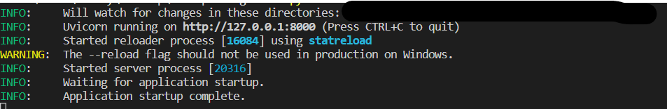
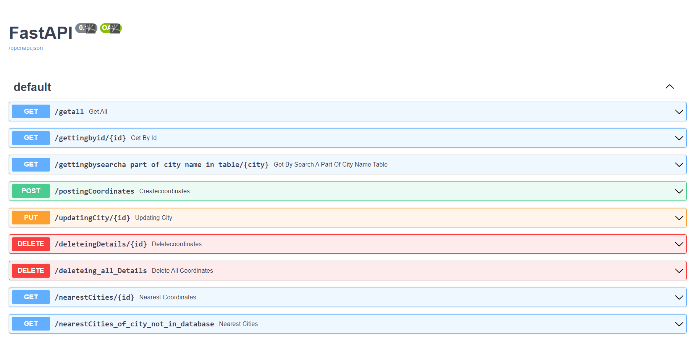

# Goal
The goal is to demonstrate your existing Python3 skills and how you
can
create a minimal API using FastAPI.

---


# Features

user can
- retrieve all the data saved  in database
- retrieve nearest address for specific address(which is present in database) by providing ID from data saved  in database .
    (retrieve the addresses that are within a given distance and location coordinates.)
- retrieve nearest address for specific address(which is not present in database) by providing address deatils from data saved in    database. (retrieve the addresses that are within a given distance and location coordinates.)
- retrieve data on basis ID number provided to data.
- retrieve data by locate content by searching for specific words or phrases.
- create data when address is entered and will get the coordinates for specific address ,added to database.
- update existed data by ID number provided.
- delete existed data by ID number provided.
- delete existed all the data.

---

## installation
use  ``` pip install -r requirements.txt ``` to install required packages which are present in requirements file

---

## Hands on
use ```python -m uvicorn main:app --reload``` to run the application




---

>use  [http://127.0.0.1:8000/docs]
you will be redirected to swagger doc 
(Swagger allows you to describe the structure of your APIs so that machines can read them. The ability of APIs to describe their own structure is the root of all awesomeness in Swagger.) 

swagger document looks like this.




On selecting, you can use each API by providing required data 


 